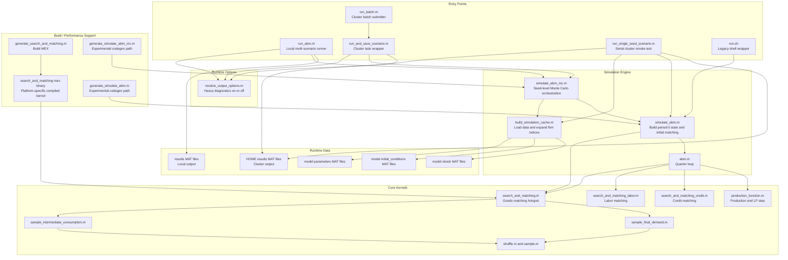

# DevOps Script Map

This note shows how the runtime scripts are organized for local runs, cluster runs, and MEX/codegen support.

## Execution Diagram

## Operational Grouping

| Layer | Main scripts | Purpose |
|---|---|---|
| User entry points | `run_abm.m`, `run_batch.m`, `run_single_seed_scenario.m` | Start local, cluster, or serial smoke-test runs |
| Cluster wrapper | `run_and_save_scenario.m` | Per-job cluster task that calls the Monte Carlo engine and saves outputs |
| Monte Carlo orchestration | `simulate_abm_mc.m` | Allocates seed output tensors and runs one `simulate_abm` call per seed |
| Shared setup | `build_simulation_cache.m` | Loads `.mat` inputs and expands country/sector/firm lookup structures |
| Single-seed engine | `simulate_abm.m` | Builds the initial economy state, computes period-0 outputs, and calls `abm` |
| Quarter dynamics | `abm.m` | Runs the per-quarter economic simulation |
| Hot kernels | `search_and_matching*.m`, `production_function.m` | Goods, labor, credit, and production bottlenecks |
| Data | `model/parameters`, `model/initial_conditions`, `model/shock` | Static inputs loaded by the cache builder |
| Build support | `generate_search_and_matching.m` | Generates platform-specific `search_and_matching.mex*` binaries |

## Local vs Cluster

- Local default path:
  - `run_abm.m -> simulate_abm_mc.m -> build_simulation_cache.m -> simulate_abm.m -> abm.m`
  - saves to `results/`

- Cluster batch path:
  - `run_batch.m -> batch(...) -> run_and_save_scenario.m -> simulate_abm_mc.m`
  - saves to `$HOME/results/`

- Serial cluster smoke-test path:
  - `run_single_seed_scenario.m -> build_simulation_cache.m -> simulate_abm.m`
  - used to isolate startup/runtime behavior without `parfor`

## DevOps Notes

- `search_and_matching` is the main compiled hotspot. The cluster must have a Linux `search_and_matching.mexa64` on its runtime path.
- `build_simulation_cache.m` is the central file for data-path resolution and scenario shock loading.
- `simulate_abm_mc.m` is the place to inspect if jobs return zero-filled arrays, because seed failures happen there.
- `generate_simulate_abm*.m` exists, but the top-level codegen path has been experimental and not the main production route.
- `run.sh` appears to be a legacy helper and is not the main current batch path.
